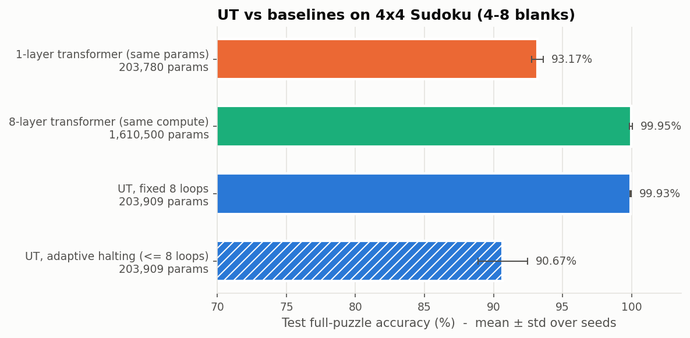
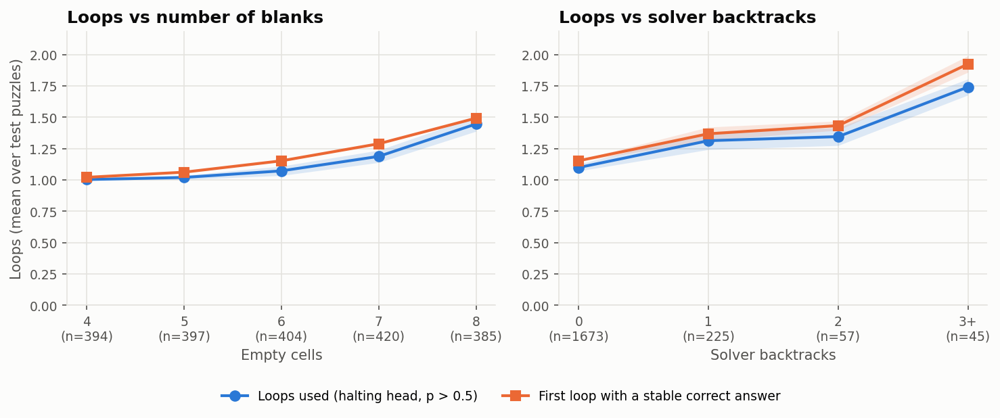
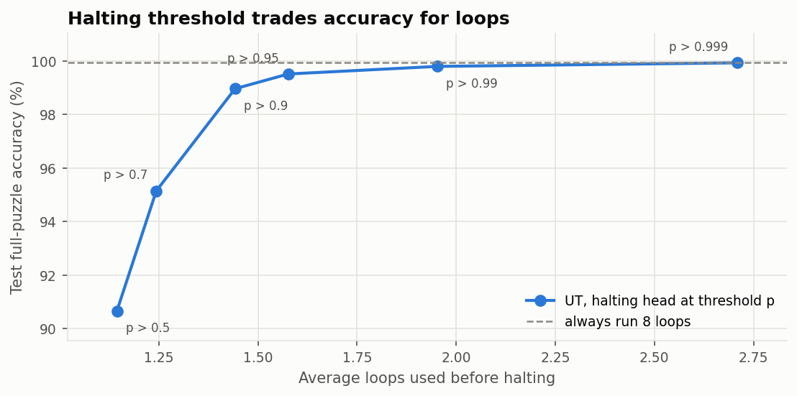
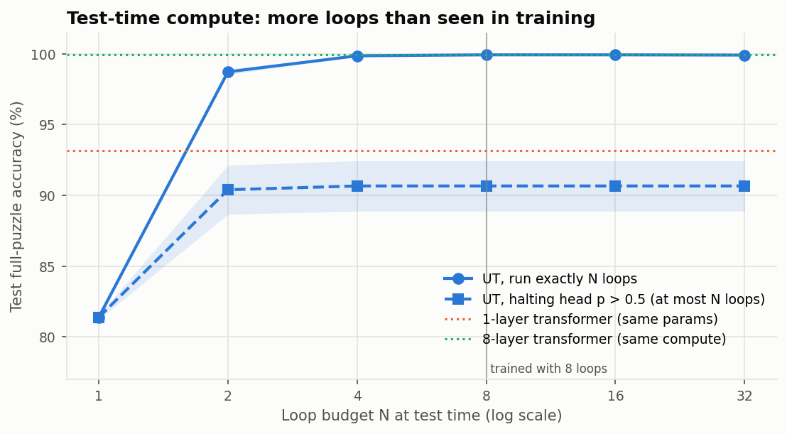
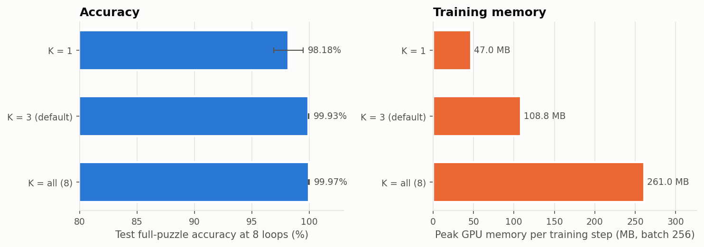

# Thinking in Loops

A small research project: a **Universal Transformer (UT)** that solves easy 4x4 Sudoku by applying
**one shared transformer block** over and over, refining its answer at every loop, and learning
**when to stop**. Everything runs on one consumer GPU (or CPU) in minutes.

## What is a Universal Transformer, and why loop?

A standard transformer stacks *N different* layers, so its depth (how many reasoning steps it can do)
is tied to its parameter count. A Universal Transformer instead applies *the same* block repeatedly:
`h_{t+1} = Block(h_t + e)`, where `e` is the embedded puzzle re-injected at every step. Depth becomes
a run-time knob rather than an architectural constant. That suits iterative problems like Sudoku,
where each round of "look at every peer cell, rule out digits, commit the forced ones" is the *same*
operation. A looped model can learn that one operation once and run it as often as needed. It can
also be run for *more* loops at test time than it saw in training, and a halting head lets it stop
early on easy inputs.

## Results

Setup for every number below: the held-out **test split (2,000 puzzles, 4–8 blanks)**, **mean ± std
over 3 seeds** (0, 1, 2), 40 epochs, batch 256, d_model=128, 4 heads, trained with 8 loops and TBPTT
K=3 unless stated otherwise, on one RTX 4070 Laptop GPU. All 15 training runs took 55 minutes
combined. Every value comes from the CSVs in [`results/`](results), which
`python scripts/run_experiments.py` regenerates.

### 1. UT vs baselines

| Model | Params | Block applications | Cell acc (blanks) | Puzzle acc | Validity | Train time |
|---|---:|---:|---:|---:|---:|---:|
| 1-layer transformer (same params) | 203,780 | 1 | 98.39 ± 0.05% | 93.17 ± 0.42% | 93.17% | 43 s |
| 8-layer transformer (same compute) | 1,610,500 | 8 | 99.98 ± 0.03% | **99.95 ± 0.09%** | 99.95% | 158 s |
| **UT, fixed 8 loops** | 203,909 | 8 | 99.98 ± 0.01% | **99.93 ± 0.03%** | 99.93% | 266 s |
| UT, halting at p > 0.5 | 203,909 | 1.14 (avg) | 98.38 ± 0.33% | 90.67 ± 1.78% | 90.67% | (same run) |



- **Looping one block matches eight distinct blocks with 7.9× fewer parameters** (99.93% vs 99.95%;
  a gap of less than one puzzle per 2,000). The same block without looping reaches only 93.17%.
- **Caveat:** both the UT and the 8-layer model are at the ceiling of this easy benchmark, so it
  cannot tell them apart. It only shows that the UT gets there with 1/8 of the weights.
- **Validity equals puzzle accuracy in every row.** No model ever produced a rule-abiding grid
  that was wrong; every mistake also broke a Sudoku rule.
- **Loop 1 of the UT is a worse one-shot solver than the 1-layer baseline** (81.4% vs 93.2%),
  even though the computation is identical. The shared block is trained to be a good *step*, not
  the best single-pass answer.
- **The 1-layer baseline trains in a staircase:** it sits at ~52% val accuracy for about 10 epochs
  before jumping to ~93% ([training curves](results/training_curves.png)).
- **Train time:** the UT trains slower than the 8-layer model despite equal block applications. It
  does 3 backward passes (one per TBPTT segment) plus 8 readouts and losses per step, against 1 for
  the baseline. Wall-clock numbers are rough: some runs shared the GPU with other work (the
  per-epoch time varied from 6.0 to 7.9 s between UT seeds).

**Generalization check.** Only 288 valid 4x4 grids exist, and the symmetry group used for
augmentation has 768 elements, so the space of easy puzzles *up to symmetry* is small. I checked
every test puzzle against all 768 transforms of the training set: **1,610 of the 2,000 test puzzles
are an exact symmetry image of some training puzzle**, even though no puzzle string is shared. On
the remaining **390 novel puzzles** ([`exp1b_novel_vs_seen.csv`](results/exp1b_novel_vs_seen.csv)):

| Model | Seen-up-to-symmetry (1,610) | Novel (390) |
|---|---:|---:|
| 1-layer transformer | 94.02 ± 0.45% | 89.66 ± 0.39% |
| 8-layer transformer | 100.00 ± 0.00% | 99.74 ± 0.44% |
| UT, fixed 8 loops | 99.98 ± 0.04% | 99.74 ± 0.00% |
| UT, halting p > 0.5 | 92.07 ± 1.55% | 84.87 ± 2.86% |

The ranking holds on novel puzzles. Novel puzzles are a bit harder for every model, and much harder
for the halting head.

### 2. Loops vs difficulty

Halting rule: stop at the first loop with halting probability > 0.5, capped at 8. "Oracle" is the
first loop after which the answer is correct and stays correct.

| Difficulty | n | Loops used (halting) | Oracle loops | Puzzle acc at the halting loop |
|---|---:|---:|---:|---:|
| 4 blanks | 394 | 1.00 | 1.02 | 98.2% |
| 5 blanks | 397 | 1.02 | 1.06 | 95.6% |
| 6 blanks | 404 | 1.07 | 1.15 | 90.4% |
| 7 blanks | 420 | 1.19 | 1.29 | 85.0% |
| 8 blanks | 385 | 1.45 | 1.49 | 84.2% |
| 0 backtracks | 1673 | 1.10 | 1.15 | 92.0% |
| 1 backtrack | 225 | 1.31 | 1.37 | 86.5% |
| 2 backtracks | 57 | 1.35 | 1.43 | 83.6% |
| 3+ backtracks | 45 | 1.74 | 1.92 | 71.9% |



- **The model spends more loops on harder puzzles**, by both difficulty measures. The halting head
  follows the oracle closely.
- **It stops slightly too early, and more so as difficulty rises.** That is where its accuracy
  drops: 98% on 4-blank puzzles vs 72% on puzzles that need 3+ solver backtracks.
- **The absolute differences are small** because these puzzles are easy: on average even the
  hardest bucket needs fewer than 2 loops. The backtrack label is a weak signal here, since 84% of
  puzzles need no backtracking at all.

#### 2b. Why halting at p > 0.5 loses accuracy (and what fixes it)

The halting head is **well calibrated**. Its mean probability at each loop matches the fraction of
puzzles actually solved at that loop (loop 1: 0.815 vs 81.4%; loop 2: 0.988 vs 98.7%;
[`exp2b_halting_calibration.csv`](results/exp2b_halting_calibration.csv)). The problem is the
**threshold**: "p > 0.5" means "stop when the answer is more likely right than wrong", which
accepts many puzzles that are only 60–90% likely to be right. Raising the threshold buys accuracy
with very few extra loops:

| Threshold | 0.5 | 0.7 | 0.9 | 0.95 | 0.99 | 0.999 |
|---|---:|---:|---:|---:|---:|---:|
| Puzzle acc | 90.67% | 95.15% | 98.97% | 99.52% | 99.80% | 99.93% |
| Avg loops | 1.14 | 1.24 | 1.44 | 1.58 | 1.95 | 2.71 |



At p > 0.999 the UT matches its fixed-8-loop accuracy (99.93%) while using **2.7 loops on
average, about a third of the compute**.

**Checkpoint selection matters too.** The best checkpoint is the *earliest* epoch with top val
puzzle accuracy, which came before the halting head finished training. Evaluating the
*final-epoch* checkpoints on test ([`exp2c_checkpoint_choice.csv`](results/exp2c_checkpoint_choice.csv)):

| Run | Checkpoint | Fixed 8 loops | Halting p > 0.5 | Avg loops |
|---|---|---:|---:|---:|
| UT (K=3) | best (selected) | 99.93% | 90.67 ± 1.78% | 1.14 |
| UT (K=3) | last epoch | 99.98% | 96.03 ± 2.15% | 1.12 |
| UT (K=all) | best (selected) | 99.97% | 86.33 ± 2.60% | 1.11 |
| UT (K=all) | last epoch | 100.00% | 96.82 ± 1.06% | 1.09 |

### 3. Test-time compute (trained with 8 loops)

| Loop budget N | 1 | 2 | 4 | 8 | 16 | 32 |
|---|---:|---:|---:|---:|---:|---:|
| Fixed: run exactly N loops | 81.38% | 98.73% | 99.87% | 99.93% | 99.93% | 99.92% |
| Halting p > 0.5, at most N loops | 81.38% | 90.40% | 90.67% | 90.67% | 90.67% | 90.67% |



- **More loops help up to the point of saturation**: 81% → 98.7% → 99.9% from 1 to 4 loops.
- **Running 2–4× more loops than in training does not hurt** (99.92% at 32 loops). The iteration
  has settled into a stable fixed point, so extra loops change nothing.
- **There is no *gain* beyond 8 loops on this benchmark**, because accuracy is already at the
  ceiling. A harder task is needed to see whether extra test-time loops help.
- **The halting curve is flat after N=2** because the head stops at about 1.1 loops whatever the
  budget.
- **Models trained with K=1 extrapolate slightly worse:** seed 0 drops from 96.7% at 8 loops to
  95.9% at 32.

### 4. Truncated backprop ablation (K = gradient window in loops)

| K | Puzzle acc (8 loops) | Acc at 32 loops | Halting p > 0.5 | Peak GPU memory / step | Train time |
|---|---:|---:|---:|---:|---:|
| 1 | 98.18 ± 1.29% | 97.75% | 90.10 ± 5.63% | **47.0 MB** | 360 s |
| 3 (default) | 99.93 ± 0.03% | 99.92% | 90.67 ± 1.78% | 108.8 MB | 266 s |
| all (8) | **99.97 ± 0.06%** | 100.00% | 86.33 ± 2.60% | 261.0 MB | 283 s |



Memory is the peak allocated CUDA memory of one isolated training step at batch 256: weights,
gradients, AdamW state and activations. Activations alone are 44.6 / 106.4 / 258.6 MB.

- **Memory grows roughly linearly with K**, and K=3 keeps almost all the accuracy of full
  backprop at 42% of its memory.
- **K=1 is the weak setting.** It is less accurate, varies a lot across seeds (best val accuracy
  96.9–99.2%), extrapolates worse, and is the slowest in wall-clock terms, because it runs 8
  separate backward passes per step.
- **Full backprop learns fastest.** It reached 100% val accuracy at epochs 5, 7 and 15, vs epochs
  15–27 for K=3 (epochs counted from 1).
- **K=all's lower halting number is a checkpoint-selection artifact**, a consequence of that fast
  learning: its best checkpoint comes from epochs 5–15, before the halting head is trained. Its
  final-epoch checkpoint halts at 96.8% (table in 2b).

### What didn't work, and other honest notes

- **Halting at p > 0.5 (the specified rule) costs about 9 points of accuracy**, as explained in 2b.
  I kept 0.5 for the headline numbers, as specified, and report the sweep separately. The demo has
  a threshold slider.
- **Selecting checkpoints by puzzle accuracy alone** picks early checkpoints with weak halting
  heads.
- **The benchmark is too easy to separate the UT from the 8-layer baseline**, or to show gains from
  test-time loops beyond 4.
- **A memory-logging bug.** `run_experiments.py` trains all runs in one process, so the per-epoch
  `peak_mem_mb` column in `results/runs/*/log.csv` picked up GPU memory left over from earlier
  runs. Only the first run (`ut_s0`) has a clean column. I fixed the trainer afterwards (it now
  garbage-collects and measures relative to its own baseline), and Exp 4 uses the isolated
  per-step measurement above, not the logs. Accuracy numbers are unaffected.
- **A failed first overfit test.** The 32-puzzle overfit test initially failed for the 8-layer
  model at lr 3e-3 with no warmup. lr 1e-3 fixed it; real training uses warmup.
- **Reproducibility.** Training with a fixed seed reproduced bit-identical metric logs across two
  separate seed-0 UT runs.

## Quick start

```bash
# 1. Environment (Python 3.10+). With conda:
conda activate ml                      # or any env with a recent PyTorch
pip install -r requirements-dev.txt    # torch, numpy, matplotlib, gradio, pytest
#   (requirements.txt points pip at the CPU torch wheels; if you already have a CUDA build of
#    torch installed, pip keeps it.)

# 2. Generate the data once (~10 s) -> data/sudoku4_{train,val,test}.npz
python scripts/generate_data.py

# 3. Train one model (~4 min on an RTX 4070 laptop GPU)
python scripts/train.py --model ut              # Universal Transformer
python scripts/train.py --model same_param      # 1-layer baseline
python scripts/train.py --model same_compute    # 8-layer baseline
python scripts/train.py --model ut --tbptt_k 1 --run_name ut_k1
python scripts/train.py --model ut --resume true                 # resume from checkpoints/ut/last.pt
python scripts/train.py --help                                   # every hyper-parameter is a flag

# 4. Run every experiment (trains whatever is missing, 3 seeds each; ~1 hour on GPU)
python scripts/run_experiments.py
python scripts/run_experiments.py --seeds 0      # one seed, ~20 min

# 5. Demo
python scripts/export_model.py                   # checkpoints/ut_s0/best.pt -> app/model/ut.pt
python app/app.py                                # http://127.0.0.1:7860

# Tests
pytest
```

**Hugging Face Spaces.** This README's front-matter already configures a Gradio Space with
`app_file: app/app.py`. Upload the repository *without* `data/` and `checkpoints/` (both are in
`.gitignore`). The app needs only `app/`, `src/`, `requirements.txt` and the exported
`app/model/ut.pt` (~0.8 MB). For example:
`hf upload <user>/thinking-in-loops . --repo-type space --exclude "data/*" --exclude "checkpoints/*" --exclude "results/runs/*"`
(`hf` ships with `huggingface_hub`, which gradio installs; run `hf auth login` first).

## Project layout

```
src/
  config.py            dataclass configs (every hyper-parameter lives here), seeding, device selection
  data/sudoku.py       rules, backtracking solver (+ backtrack count, uniqueness), puzzle generator
  data/augment.py      batched symmetry augmentation (digits, rows/cols within bands/stacks, transpose)
  data/dataset.py      generate splits once -> .npz; load as tensors
  models/layers.py     RMSNorm, non-causal multi-head attention, SwiGLU, pre-norm block, row/col/box embeddings
  models/models.py     UniversalTransformer + StackedTransformer baselines behind one API
  training/step.py     deep supervision + halting loss + truncated backprop through loops
  training/trainer.py  AdamW, warmup + cosine, clipping, CSV logs, best/last checkpoints, resume
  eval/metrics.py      per-loop predictions, halting, cell/puzzle accuracy, validity
  eval/experiments.py  the four experiments (CSV + PNG each)
scripts/               generate_data.py, train.py, run_experiments.py, export_model.py
app/app.py             Gradio demo (CPU)
tests/                 pytest suite (data, models, training, app)
results/               plots, CSVs, summary.json, per-run training logs
```

## Design decisions (where the spec was ambiguous)

I chose the simplest reasonable option in each case:

- **Hidden state and input injection.** `h_0 = 0`, then `h_{t+1} = Block(h_t + e)`. Loop 1 is
  therefore exactly a 1-layer transformer on the puzzle, which makes the same-parameter baseline a
  clean comparison.
- **Truncated backprop (K).** The loops are cut into segments of at most K loops, aligned so the
  *last* segment has exactly K loops (8 loops with K=3 gives 2+3+3). The hidden state is detached
  between segments and `backward()` runs once per segment. Every loop still gets its own
  deep-supervision loss, but its gradient flows through at most K block applications. Only one
  segment's activations are alive at a time, which is why memory scales with K. Gradients
  accumulate and the optimizer steps once per batch.
- **Losses.** Cross-entropy over *all 16 cells* (clues included; copying them is trivial),
  averaged over loops. The halting loss is BCE against "the whole grid is correct at this loop",
  weight 0.5, also averaged over loops. The baselines have no halting head and are supervised on
  their single output.
- **Metrics.** *Cell accuracy* counts only the blank cells. *Puzzle accuracy* needs all 16 cells
  right. *Validity* means no repeated digit in any row, column or box; it ignores the clues, so a
  valid grid can still be wrong. Because every puzzle has a unique solution, an output that is
  valid **and** matches the clues is necessarily the solution.
- **Halting at test time.** Stop at the first loop with `sigmoid(halt) > 0.5`, otherwise at the
  loop cap, and use that loop's answer. "Fixed N loops" means always using loop N's answer.
- **Model selection.** The best checkpoint is chosen by val puzzle accuracy after the full 8 loops
  (ties keep the earliest epoch). Every reported number is on the held-out **test** split.
- **Backtrack count.** Assignments undone before the first solution is found, with cells filled in
  row-major order and digits tried in ascending order (deterministic per puzzle).
- **Augmentation.** Only the symmetries listed in the spec (no band/stack swaps): 32 cell
  permutations × 24 digit relabelings, sampled per example on the GPU.
- **Mixed precision.** bf16 autocast on CUDA (no grad scaler needed). Training with a fixed seed
  is bit-for-bit reproducible on this GPU: two seed-0 UT runs produced identical logs.

## Demo

`python app/app.py` starts a Gradio app on CPU:

- **Input:** generate an easy puzzle (choose 4–8 blanks) or type your own 16 cells.
- **Loop slider:** shows the grid after any loop. Clues are grey, predicted cells are shaded by the
  model's confidence (the % is in the corner), and cells that disagree with the true solution get a
  red outline with ✗.
- **Halting plot:** halting probability and mean confidence per loop, with the loop where the model
  stopped marked.
- **Settings:** max loops (1–32) and the halting threshold, so you can reproduce Exp 2b
  interactively.

The shipped model `app/model/ut.pt` is the selected (best) checkpoint of seed 0. To show the
better-calibrated final-epoch halting head instead, run
`python scripts/export_model.py --checkpoint checkpoints/ut_s0/last.pt`.

